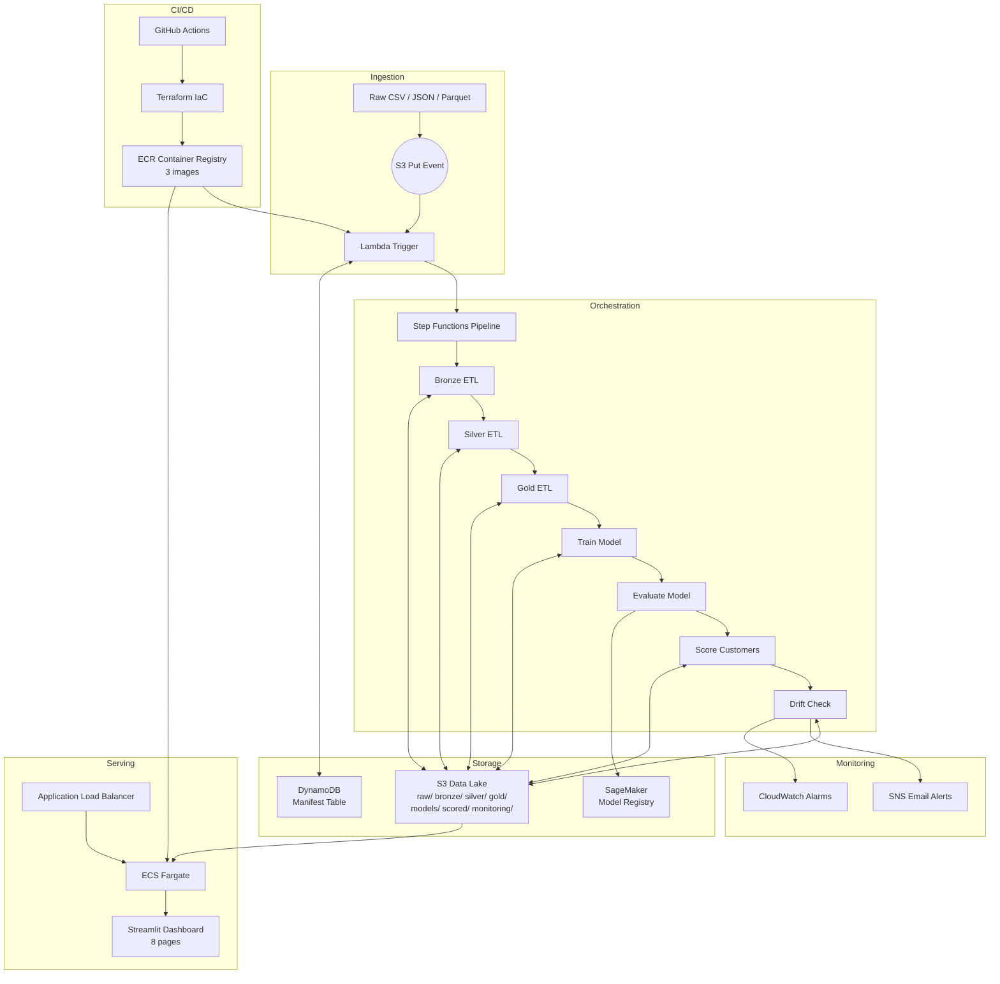
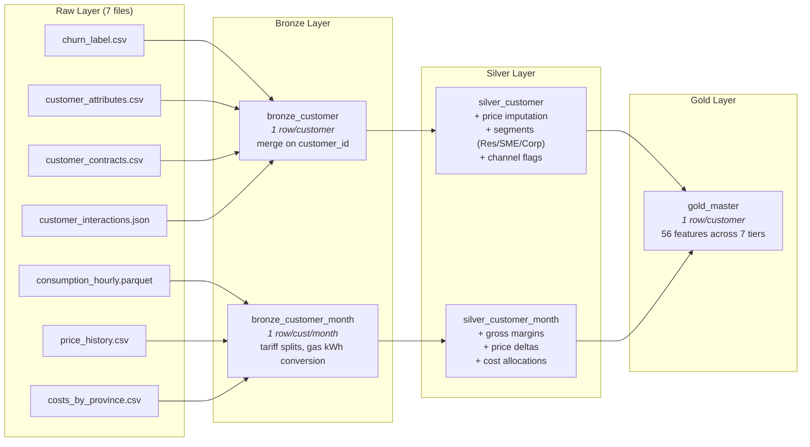
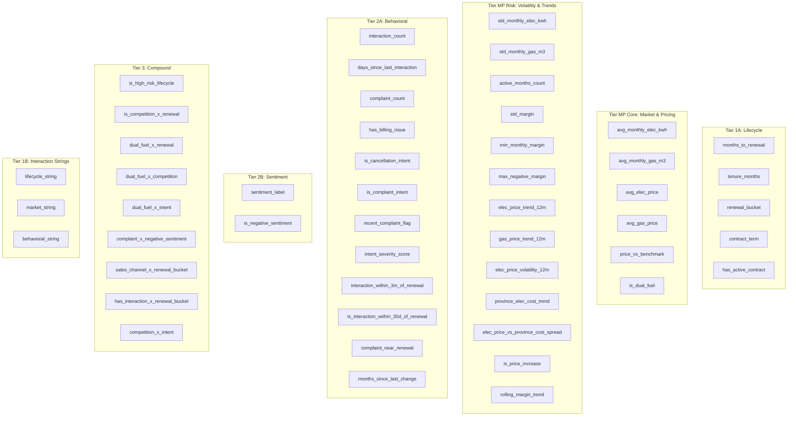
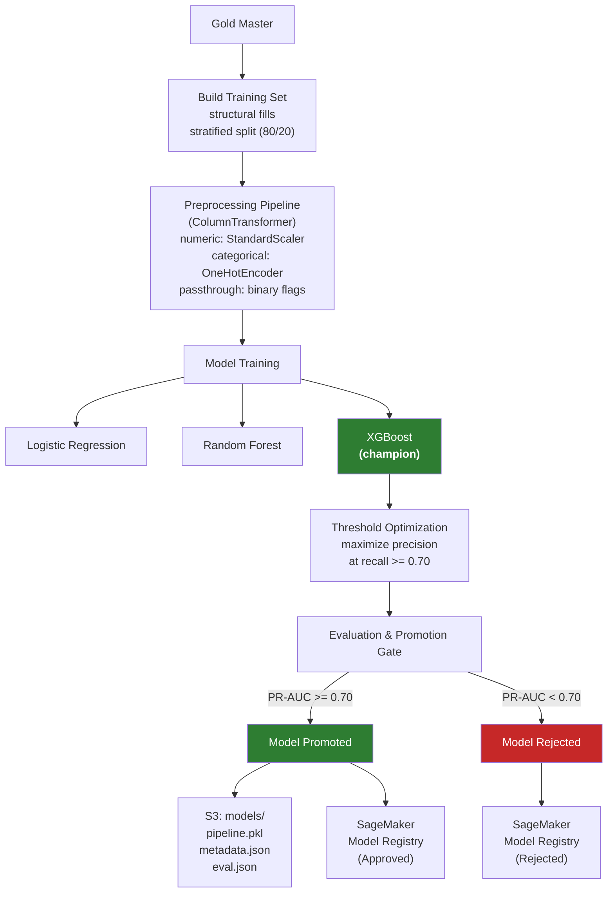
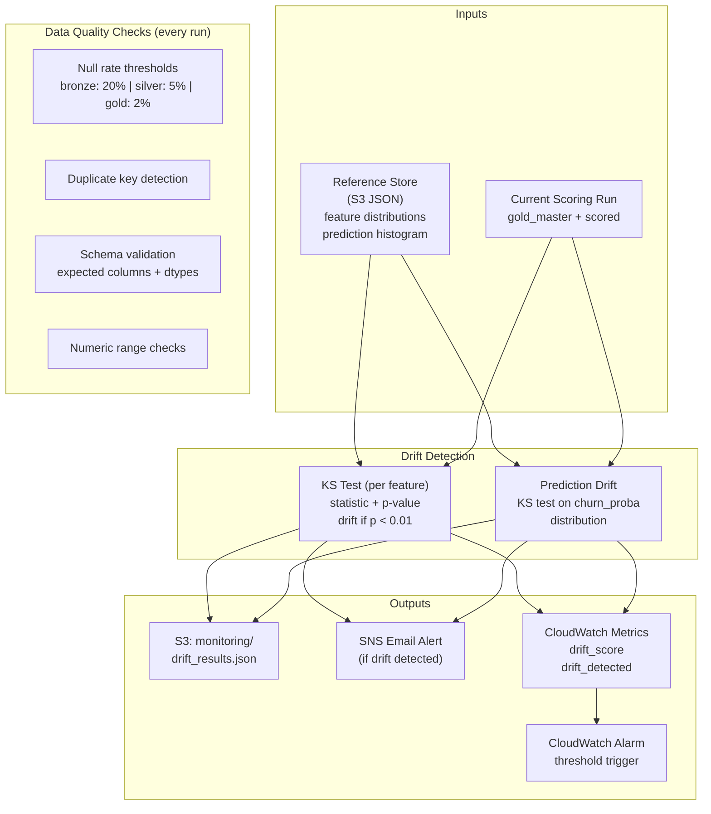
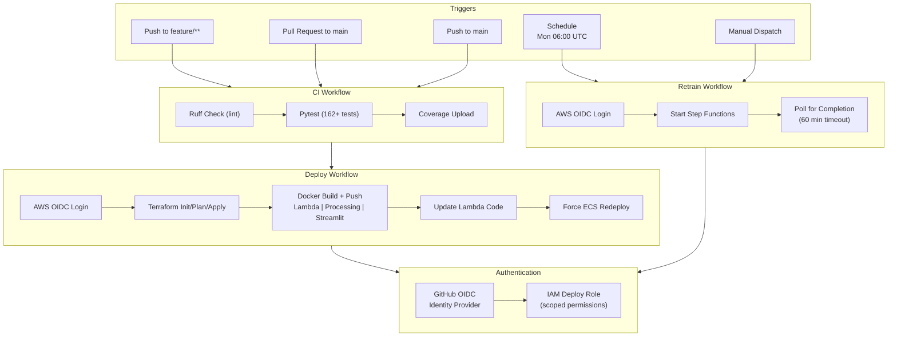
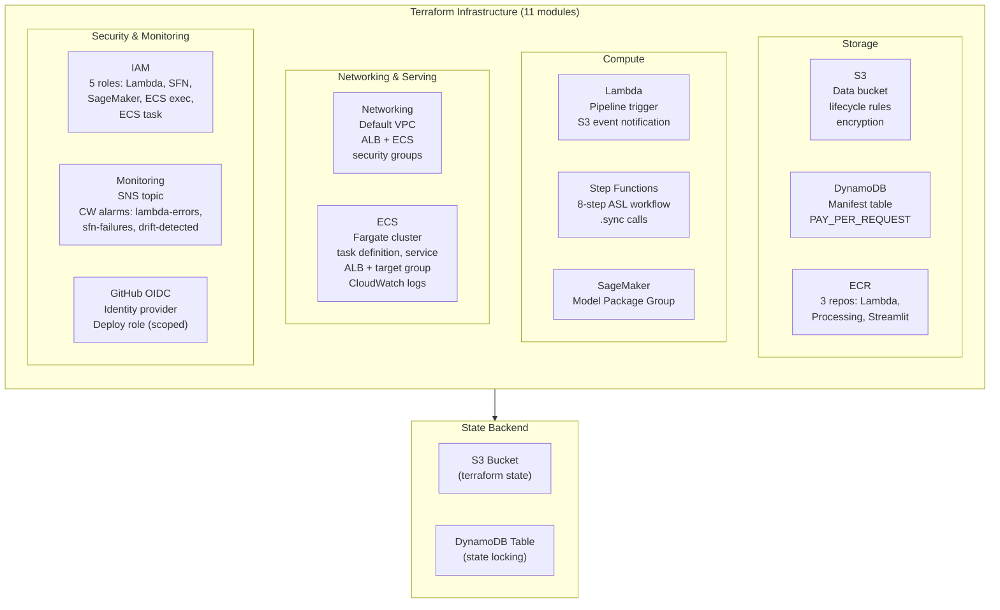

# SpanishGas — Customer Churn Prediction MLOps Platform

An end-to-end MLOps system that predicts customer churn for 20,099 Spanish energy customers, generates retention recommendations, and serves results through an auto-deployed Streamlit dashboard. Built on AWS with Terraform IaC, GitHub Actions CI/CD, and a medallion data architecture (bronze/silver/gold).

---

## Table of Contents

- [Project Overview](#project-overview)
- [Datasets](#datasets)
- [High-Level Architecture](#high-level-architecture)
- [Data Pipeline Architecture](#data-pipeline-architecture)
- [ML Training & Evaluation Architecture](#ml-training--evaluation-architecture)
- [Monitoring & Drift Detection Architecture](#monitoring--drift-detection-architecture)
- [Serving & Dashboard Architecture](#serving--dashboard-architecture)
- [CI/CD & Deployment Architecture](#cicd--deployment-architecture)
- [Infrastructure Architecture](#infrastructure-architecture)
- [Repository Structure](#repository-structure)
- [Getting Started](#getting-started)
  - [Prerequisites](#prerequisites)
  - [Local Development Setup](#local-development-setup)
  - [Running the Pipeline Locally](#running-the-pipeline-locally)
  - [Running the Dashboard Locally](#running-the-dashboard-locally)
  - [Running Tests](#running-tests)
- [AWS Deployment](#aws-deployment)
  - [Terraform Setup](#terraform-setup)
  - [Docker Images](#docker-images)
  - [Deploying Infrastructure](#deploying-infrastructure)
  - [Triggering the Pipeline](#triggering-the-pipeline)
  - [GitHub Actions CI/CD](#github-actions-cicd)
- [Feature Engineering](#feature-engineering)
- [Model Details](#model-details)
- [Recommendation Engine](#recommendation-engine)

---

## Project Overview

SpanishGas is a decision intelligence platform for a Spanish gas and electricity utility. The system:

1. **Ingests** 7 raw datasets through a medallion ETL pipeline (raw -> bronze -> silver -> gold)
2. **Trains** an XGBoost churn model with 7 feature tiers across 9 experiment configurations
3. **Scores** all customers with churn probability, risk tier assignment, and expected monthly loss
4. **Detects drift** using Kolmogorov-Smirnov tests on features and predictions
5. **Generates recommendations** mapping risk tiers to retention actions with policy guardrails
6. **Serves** results through an 8-page Streamlit dashboard auto-deployed on AWS ECS Fargate
7. **Orchestrates** everything via AWS Step Functions, triggered automatically on S3 data upload

---

## Datasets

The system consumes **7 raw datasets** that describe customers, their contracts, consumption patterns, pricing, costs, interactions, and churn outcomes:

| # | Dataset | Format | Grain | Description |
|---|---------|--------|-------|-------------|
| 1 | **churn_label** | CSV | 1 row/customer | Binary churn outcome within a configurable horizon (days). Includes `churned_within_horizon`, `churn_effective_date`, and `label_date`. |
| 2 | **customer_attributes** | CSV | 1 row/customer | Static customer demographics: `province`, `customer_type`, `tariff_type`, `signup_date`, `product_bundle`. |
| 3 | **customer_contracts** | CSV | 1 row/contract | Contract lifecycle: `contract_start_date`, `contract_end_date`, `contract_status`, `contract_term_months`, `product_type`. |
| 4 | **consumption_hourly_2024** | Parquet | 1 row/hour/customer | Hourly electricity (kWh) and gas (m3) meter readings. ~17M rows for 20K customers across 2024. Gas converted to kWh at 11 kWh/m3. |
| 5 | **price_history** | CSV | 1 row/date/product/tariff | Daily electricity and gas prices per tariff type and region, plus market benchmark prices for delta calculation. |
| 6 | **costs_by_province_month** | CSV | 1 row/month/province | Monthly variable costs, fixed costs, and network costs per province and commodity. |
| 7 | **customer_interactions** | JSON | 1 row/interaction | Customer service interactions: `channel`, `interaction_type`, `sentiment_score`, `resolution_status`. Includes complaints, billing issues, and cancellation intents. |

---

## High-Level Architecture



---

## Data Pipeline Architecture

The ETL pipeline follows a **medallion architecture** (bronze/silver/gold) implemented as SageMaker Processing Jobs orchestrated by Step Functions.



### Feature Tiers in Gold Master



---

## ML Training & Evaluation Architecture



---

## Monitoring & Drift Detection Architecture



---

## Serving & Dashboard Architecture

```mermaid
graph LR
    INTERNET["Internet"] --> ALB["ALB<br/>:80"]
    ALB --> ECS["ECS Fargate Task<br/>:8501"]
    ECS --> APP["Streamlit App"]

    subgraph Pages["Dashboard Pages"]
        direction TB
        P1["Overview<br/>KPI cards, at-risk %,<br/>monthly loss, pipeline runs"]
        P2["Data Explorer<br/>Browse raw/bronze/silver/gold<br/>data tables"]
        P3["Model Performance<br/>PR-AUC, ROC-AUC, confusion<br/>matrix, precision, recall"]
        P4["Drift Monitor<br/>KS stats, feature drift<br/>table, bar chart"]
        P5["Customer Risk<br/>Risk tier distribution,<br/>expected loss, customer table"]
        P6["Customer Lookup<br/>Individual risk profile,<br/>financial impact, reason codes"]
        P7["Recommendations<br/>Action breakdown by tier,<br/>retention offers, timing"]
        P8["Pipeline Status<br/>Run history, success/fail<br/>counts from DynamoDB"]
    end

    APP --> Pages

    subgraph Data["Data Sources"]
        S3S["S3: scored/scored_customers.parquet"]
        S3E["S3: models/eval.json"]
        S3DR["S3: monitoring/drift_results.json"]
        S3R["S3: scored/recommendations.parquet"]
        DDB["DynamoDB: manifest table"]
    end

    Pages --> Data
```



---

## CI/CD & Deployment Architecture



---

## Infrastructure Architecture



---

## Repository Structure

```
.
├── configs/
│   ├── settings.py                  # Settings dataclass with dotenv loading
│   ├── feature_tiers.yaml           # 7 feature tiers + 9 experiment definitions
│   └── column_registry.yaml         # Raw dataset schemas, dtypes, structural fills
├── src/
│   ├── data/
│   │   ├── ingest.py                # Raw loading, bronze customer & customer-month
│   │   ├── silver.py                # Price imputation, segmentation, margins
│   │   ├── nlp.py                   # NLP enrichment: regex intent + HuggingFace sentiment
│   │   └── build_training_set.py    # Model matrix, structural fills, stratified split
│   ├── features/
│   │   └── build_features.py        # 7 feature tiers, gold master builder
│   ├── models/
│   │   ├── preprocessing.py         # ColumnTransformer pipeline (scale + encode)
│   │   ├── churn_model.py           # Model defs, threshold optimization, evaluation
│   │   ├── scorer.py                # Batch scoring, risk tier assignment
│   │   ├── artifacts.py             # Save/load sklearn pipelines + metadata to S3
│   │   └── registry.py              # SageMaker Model Registry wrapper
│   ├── reco/
│   │   ├── schema.py                # Recommendation dataclass with guardrails
│   │   └── engine.py                # Risk tier -> retention action mapping
│   ├── pipelines/
│   │   ├── lambda_handler.py        # S3 trigger -> DynamoDB check -> SFN start
│   │   ├── manifest.py              # DynamoDB manifest with conditional writes
│   │   ├── s3_io.py                 # Read/write parquet/CSV/JSON via boto3
│   │   ├── run.py                   # Local pipeline runner (filesystem I/O)
│   │   └── steps/
│   │       ├── bronze_step.py       # SageMaker Processing: raw -> bronze
│   │       ├── silver_step.py       # SageMaker Processing: bronze -> silver
│   │       ├── gold_step.py         # SageMaker Processing: silver -> gold
│   │       ├── train_step.py        # SageMaker Processing: train XGBoost
│   │       ├── evaluate_step.py     # SageMaker Processing: evaluate + promote gate
│   │       ├── score_step.py        # SageMaker Processing: batch scoring + recommendations
│   │       └── drift_step.py        # SageMaker Processing: KS drift detection
│   ├── monitoring/
│   │   ├── drift.py                 # KS-test feature + prediction drift
│   │   ├── data_quality.py          # Null rates, duplicates, schema, ranges
│   │   ├── alerts.py                # SNS publish + CloudWatch metrics
│   │   └── reference_store.py       # Save/load reference distributions (S3 JSON)
│   └── serving/ui/
│       ├── app.py                   # Streamlit main entry, sidebar navigation
│       ├── data_loader.py           # Cached loading (local / S3 / DynamoDB)
│       └── pages/
│           ├── overview.py          # Executive KPI dashboard
│           ├── data_explorer.py     # Browse data across all pipeline layers
│           ├── model_performance.py # PR-AUC, confusion matrix, metrics
│           ├── drift_monitor.py     # Feature drift table + KS bar chart
│           ├── customer_risk.py     # Risk tier distribution, customer table
│           ├── customer_lookup.py   # Individual customer risk profile + financials
│           ├── recommendations.py   # Retention actions, filterable table
│           └── pipeline_status.py   # Run history from DynamoDB manifest
├── infra/terraform/
│   ├── main.tf                      # Provider, 11 module blocks
│   ├── backend.tf                   # S3 remote state backend
│   ├── variables.tf                 # All configurable variables
│   ├── outputs.tf                   # Key ARNs, URLs, DNS names
│   ├── environments/
│   │   ├── dev.tfvars
│   │   ├── staging.tfvars
│   │   └── prod.tfvars
│   └── modules/
│       ├── s3/                      # Data bucket with lifecycle
│       ├── dynamodb/                # Manifest table
│       ├── ecr/                     # 3 container repos (lambda, processing, streamlit)
│       ├── iam/                     # 5 IAM roles (lambda, sfn, sagemaker, ecs x2)
│       ├── lambda/                  # Pipeline trigger + S3 notification
│       ├── step_functions/          # State machine + ASL definition
│       ├── sagemaker/               # Model Package Group
│       ├── monitoring/              # SNS + CloudWatch alarms
│       ├── networking/              # Default VPC, ALB + ECS security groups
│       ├── ecs/                     # Fargate cluster, ALB, task def, service
│       └── github_oidc/             # OIDC provider + deploy role
├── .github/workflows/
│   ├── ci.yml                       # Lint + test on push/PR
│   ├── deploy.yml                   # Terraform + Docker + ECS on push to main
│   └── retrain.yml                  # Weekly/manual Step Functions trigger
├── tests/                           # 19 test files, 162+ tests
├── notebooks/                       # Source Jupyter notebooks (01: ETL, 02: modeling)
├── Dockerfile.lambda                # Lambda container image
├── Dockerfile.processing            # SageMaker Processing container image
├── Dockerfile.streamlit             # Streamlit dashboard container image
├── Makefile                         # install, lint, test, docker, terraform targets
├── pyproject.toml                   # Dependencies, ruff config, pytest config
└── .env.example                     # All environment variables template
```

---

## Getting Started

### Prerequisites

- **Python 3.10+** (3.12 recommended)
- **Docker** (for container builds)
- **AWS CLI v2** (for deployment)
- **Terraform >= 1.5** (for infrastructure)
- **Git**

### Local Development Setup

```bash
# 1. Clone the repository
git clone https://github.com/rawad-yared/bcgx-spanishgas-g1.git
cd bcgx-spanishgas-g1

# 2. Create and activate a virtual environment
python3 -m venv .venv
source .venv/bin/activate

# 3. Install dependencies (runtime + dev)
make install
# or manually:
pip install -e ".[dev]"

# 4. Copy environment template
cp .env.example .env
# Edit .env with your AWS credentials and settings

# 5. Verify everything works
make lint    # ruff check — should pass clean
make test    # pytest — should pass 162+ tests
```

### Running the Pipeline Locally

The local pipeline runner uses filesystem I/O instead of S3/SageMaker:

```bash
# Place your 7 raw data files in data/raw/
mkdir -p data/raw
cp /path/to/churn_label.csv data/raw/
cp /path/to/customer_attributes.csv data/raw/
cp /path/to/customer_contracts.csv data/raw/
cp /path/to/consumption_hourly_2024.csv data/raw/
cp /path/to/price_history.csv data/raw/
cp /path/to/costs_by_province_month.csv data/raw/
cp /path/to/customer_interactions.json data/raw/

# Run the pipeline (creates bronze/ silver/ gold/ scored/ directories)
python -m src.pipelines.run
```

### Running the Dashboard Locally

```bash
# Option A: Direct
make streamlit
# or:
streamlit run src/serving/ui/app.py --server.headless=true

# Option B: Docker
make docker-build-streamlit
make docker-run-streamlit
# Then open http://localhost:8501
```

The dashboard works in local mode by default — it reads from `data/scored/`, `data/models/`, and `data/monitoring/` directories. Set `DATA_SOURCE=s3` to read from AWS.

### Running Tests

```bash
# All tests
make test

# With coverage report
make test-cov

# Skip slow E2E tests
pytest tests/ -m "not slow"

# Run a specific test file
pytest tests/test_drift.py -v
```

---

## AWS Deployment

### Terraform Setup

```bash
# 1. Create the state backend (one-time, via AWS Console or CLI)
aws s3 mb s3://YOUR-PROJECT-terraform-state --region eu-west-1
aws s3api put-bucket-versioning \
  --bucket YOUR-PROJECT-terraform-state \
  --versioning-configuration Status=Enabled
aws dynamodb create-table \
  --table-name YOUR-PROJECT-terraform-locks \
  --attribute-definitions AttributeName=LockID,AttributeType=S \
  --key-schema AttributeName=LockID,KeyType=HASH \
  --billing-mode PAY_PER_REQUEST \
  --region eu-west-1

# 2. Update infra/terraform/backend.tf with your bucket/table names

# 3. Initialize and deploy
cd infra/terraform
terraform init
terraform plan -var-file=environments/dev.tfvars
terraform apply -var-file=environments/dev.tfvars
```

### Docker Images

```bash
# Login to ECR
aws ecr get-login-password --region eu-west-1 | \
  docker login --username AWS --password-stdin YOUR_ACCOUNT_ID.dkr.ecr.eu-west-1.amazonaws.com

# Build and push all 3 images (use --platform linux/amd64 --provenance=false for Lambda/SageMaker)
ECR=YOUR_ACCOUNT_ID.dkr.ecr.eu-west-1.amazonaws.com

docker build --platform linux/amd64 --provenance=false -f Dockerfile.lambda -t $ECR/YOUR-PROJECT-dev-lambda:latest .
docker push $ECR/YOUR-PROJECT-dev-lambda:latest

docker build --platform linux/amd64 --provenance=false -f Dockerfile.processing -t $ECR/YOUR-PROJECT-dev-processing:latest .
docker push $ECR/YOUR-PROJECT-dev-processing:latest

docker build --platform linux/amd64 --provenance=false -f Dockerfile.streamlit -t $ECR/YOUR-PROJECT-dev-streamlit:latest .
docker push $ECR/YOUR-PROJECT-dev-streamlit:latest
```

### Deploying Infrastructure

After `terraform apply`, note the key outputs:

```bash
terraform output
# s3_bucket_name           = "spanishgas-data-dev"
# lambda_function_arn      = "arn:aws:lambda:..."
# state_machine_arn        = "arn:aws:states:..."
# streamlit_alb_dns_name   = "spanishgas-dev-streamlit-alb-XXXX.eu-west-1.elb.amazonaws.com"
# github_deploy_role_arn   = "arn:aws:iam::...:role/spanishgas-dev-github-deploy-role"
```

The Streamlit dashboard will be accessible at the `streamlit_alb_dns_name` URL.

### Triggering the Pipeline

```bash
# Upload raw data to S3 — this auto-triggers the full pipeline
aws s3 cp data/raw/ s3://YOUR-BUCKET/raw/ --recursive

# Or manually start via Step Functions
aws stepfunctions start-execution \
  --state-machine-arn YOUR_SFN_ARN \
  --input '{"mode": "train", "run_id": "manual-001", "file_key": "raw/churn_label.csv"}'
```

### GitHub Actions CI/CD

To enable automated deployments:

1. Run `terraform output github_deploy_role_arn` to get the OIDC deploy role ARN
2. Go to your GitHub repo **Settings > Secrets and Variables > Actions**
3. Add secret: `AWS_DEPLOY_ROLE_ARN` = the role ARN from step 1
4. Pushes to `main` will now auto-deploy (Terraform + Docker + ECS)

---

## Feature Engineering

The gold master contains **56 features** organized into 7 tiers, tested across 9 experiment configurations:

| Experiment | Tiers Included | Description |
|------------|---------------|-------------|
| E0 | 1A | Lifecycle features only (baseline) |
| E1 | 1A + MP Core | Add market/pricing features |
| E2 | 1A + MP Core + MP Risk | Add volatility/risk metrics |
| E3 | + 2A Behavioral | Add interaction features |
| E4 | + 2B Sentiment | Add sentiment analysis |
| **E5_full** | **+ 3 Compound** | **Full set (champion)** |
| E6 | + 1B Strings | Full + interaction strings (linear models) |
| E7 | MP Core + MP Risk | Market features only (ablation) |
| E8_no_sentiment | All except 2B | Full set without sentiment (production fallback) |

---

## Model Details

| Property | Value |
|----------|-------|
| Algorithm | XGBoost (E5_full experiment) |
| Hyperparameters | n_estimators=600, lr=0.05, max_depth=5, subsample=0.8, colsample_bytree=0.8 |
| Features | 56 features across 7 tiers (lifecycle, market, risk, behavioral, sentiment, compound, strings) |
| NLP enrichment | Regex intent classification (8 categories) + HuggingFace sentiment (`cardiffnlp/twitter-roberta-base-sentiment-latest`) |
| Target | `churned_within_horizon` (binary) |
| Threshold | Optimized for precision at recall >= 0.70 |
| PR-AUC | **0.751** (production pipeline, exceeds 0.70 gate) |
| Promotion gate | PR-AUC >= 0.70 |
| Risk tiers | Low (<40%), Medium (40-60%), High (60-80%), Critical (>80%) |
| Retraining | Weekly (Monday 06:00 UTC) or manual trigger |

---

## Recommendation Engine

The recommendation engine maps risk tiers to retention actions with policy guardrails:

| Risk Tier | Action | Timing Window |
|-----------|--------|---------------|
| Low (<40%) | No offer | 60-90 days |
| Medium (40-60%) | Small offer | 30-60 days |
| High (60-80%) | Medium offer | Immediate |
| Critical (>80%) | Large offer | Immediate |

**Guardrails:**
- No negative-margin offers: if `expected_margin_impact < 0`, action forced to `no_offer`
- Explainability required: every recommendation must include non-empty `reason_codes`
- Risk score validated to [0, 1] range
