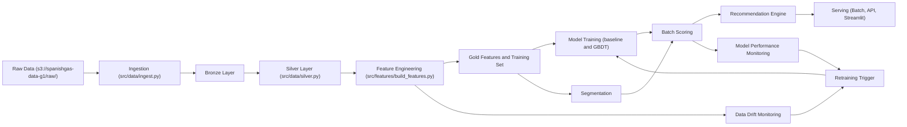
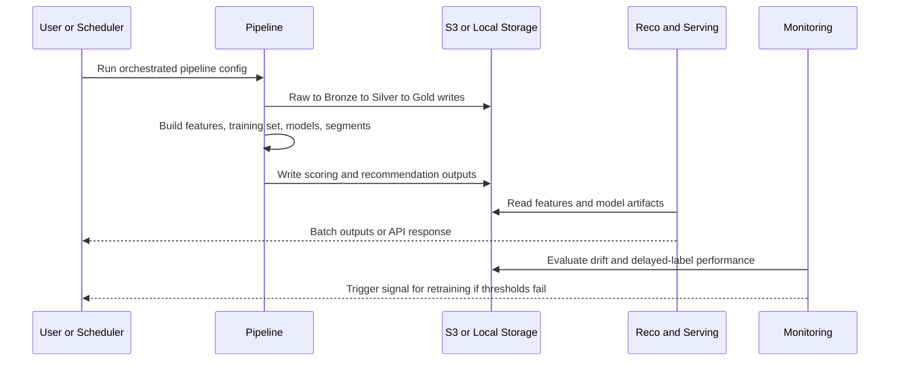

# SpanishGas Decision Intelligence Platform

End-to-end platform for churn prediction and retention optimization in gas/electricity retail.  
The system combines predictive risk scoring, customer segmentation, prescriptive recommendation logic, and monitoring/retraining signals.

## Objective

- Maximize incremental retained margin (EUR), not retention alone.
- Identify who is likely to churn and why.
- Recommend financially viable interventions with policy guardrails.
- Operate through reproducible pipelines with monitoring and CI quality gates.

## Business and Technical Context

The implementation follows:

- `docs/BRD.md` for business objectives and success metrics.
- `docs/ARCHITECTURE.md` for modular architecture, observability, and CI/CD design.
- `docs/TICKETS.md` for implementation scope and ticket-level deliverables.

## Architecture


```mermaid
flowchart LR
    A["Raw Data (s3://spanishgas-data-g1/raw/)"] --> B["Ingestion (src/data/ingest.py)"]
    B --> C["Bronze Layer"]
    C --> D["Silver Layer (src/data/silver.py)"]
    D --> E["Feature Engineering (src/features/build_features.py)"]
    E --> F["Gold Features and Training Set"]
    F --> G["Model Training (baseline and GBDT)"]
    F --> H["Segmentation"]
    G --> I["Batch Scoring"]
    H --> I
    I --> J["Recommendation Engine"]
    J --> K["Serving (Batch, API, Streamlit)"]
    E --> L["Data Drift Monitoring"]
    I --> M["Model Performance Monitoring"]
    L --> N["Retraining Trigger"]
    M --> N
    N --> G
```

## Workflow


```mermaid
sequenceDiagram
    participant U as User or Scheduler
    participant P as Pipeline
    participant S as S3 or Local Storage
    participant R as Reco and Serving
    participant M as Monitoring

    U->>P: Run orchestrated pipeline config
    P->>S: Raw to Bronze to Silver to Gold writes
    P->>P: Build features, training set, models, segments
    P->>S: Write scoring and recommendation outputs
    R->>S: Read features and model artifacts
    R-->>U: Batch outputs or API response
    M->>S: Evaluate drift and delayed-label performance
    M-->>U: Trigger signal for retraining if thresholds fail
```

## Data Layout and Storage

Primary source-of-truth raw location:

- `s3://spanishgas-data-g1/raw/`

Common layer conventions:

- Bronze: `s3://spanishgas-data-g1/bronze/` or `data/.../bronze/`
- Silver: `s3://spanishgas-data-g1/silver/` or `data/.../silver/`
- Gold: `s3://spanishgas-data-g1/gold/` or `data/.../gold/`
- Artifacts: `artifacts/`

Most modules support both local paths and `s3://` URIs.

## Repository Structure

```text
.
├── .github/workflows/       # CI workflow (lint + tests)
├── configs/                 # YAML runtime configs
├── docs/                    # BRD, architecture, tickets
├── notebooks/               # Jupyter notebooks
├── src/
│   ├── data/                # contracts, ingestion, silver, training set
│   ├── features/            # feature engineering
│   ├── models/              # churn models + segmentation
│   ├── monitoring/          # drift + delayed-label monitoring
│   ├── pipelines/           # end-to-end orchestration
│   ├── reco/                # recommendation schema, engine, simulation
│   └── serving/             # batch scoring, API, Streamlit UI
├── tests/                   # unit tests
├── Dockerfile               # API image
├── Dockerfile.train         # training image
├── Makefile                 # lint/test commands
└── pyproject.toml
```

## Python Modules and Responsibilities

| Module | Responsibility | Example Run Command |
| --- | --- | --- |
| `src/data/contracts.py` | Source and gold dataset contracts | Imported by ingestion/validation modules |
| `src/data/ingest.py` | Raw to Bronze ingestion with metadata logging | `python -m src.data.ingest --run-date 2026-02-09` |
| `src/data/silver.py` | Bronze to Silver conforming transforms and data quality checks | `python -m src.data.silver --run-date 2026-02-09` |
| `src/features/build_features.py` | Leakage-safe customer features by as-of date | `python -m src.features.build_features --asof-date 2026-01-31` |
| `src/data/build_training_set.py` | Gold training-set assembly with temporal splits | `python -m src.data.build_training_set --config configs/training_set.yaml` |
| `src/models/churn_baseline.py` | Logistic regression baseline training and evaluation | `python -m src.models.churn_baseline --config configs/model_baseline.yaml` |
| `src/models/churn_gbdt.py` | GBDT model training and comparison to baseline | `python -m src.models.churn_gbdt --config configs/model_gbdt.yaml` |
| `src/models/segmentation.py` | Customer clustering and segment profile report | `python -m src.models.segmentation --asof-date 2026-01-31` |
| `src/reco/schema.py` | Recommendation output contract and guardrails | Imported by recommendation components |
| `src/reco/recommend.py` | Deterministic recommendation generation | `python -m src.reco.recommend --run-date 2026-02-09` |
| `src/reco/simulate.py` | Offer simulation and ROI reporting | `python -m src.reco.simulate --config configs/reco_sim.yaml` |
| `src/pipelines/run_pipeline.py` | End-to-end orchestrated pipeline execution | `python -m src.pipelines.run_pipeline --config configs/pipeline.yaml` |
| `src/serving/batch_score.py` | Batch scoring plus recommendation artifacts | `python -m src.serving.batch_score --run-date 2026-02-09` |
| `src/serving/api/main.py` | FastAPI real-time score endpoint | `uvicorn src.serving.api.main:app --host 0.0.0.0 --port 8000` |
| `src/serving/ui/app.py` | Streamlit dashboard for at-risk customers | `streamlit run src/serving/ui/app.py` |
| `src/monitoring/data_drift.py` | Feature drift checks (missingness delta, PSI) | `python -m src.monitoring.data_drift --run-date 2026-02-09` |
| `src/monitoring/model_perf.py` | Delayed-label performance and retraining trigger | `python -m src.monitoring.model_perf --config configs/monitoring.yaml` |

## Quickstart (Local)

1. Create and activate a virtual environment.
2. Install package and runtime dependencies.
3. Run lint and tests.

```bash
python3 -m venv .venv
source .venv/bin/activate
python -m pip install --upgrade pip
python -m pip install -e .
python -m pip install pytest pre-commit pyyaml numpy scikit-learn fastapi "uvicorn[standard]" pydantic boto3 httpx streamlit
make lint
make test
```

## Run the End-to-End Pipeline

```bash
python -m src.pipelines.run_pipeline --config configs/pipeline.yaml
```

## Monitoring Commands

```bash
python -m src.monitoring.data_drift --run-date 2026-02-09
python -m src.monitoring.model_perf --config configs/monitoring.yaml
```

## Serving Interfaces

API:

```bash
uvicorn src.serving.api.main:app --host 0.0.0.0 --port 8000
```

Example request:

```bash
curl -X POST http://localhost:8000/score \
  -H "Content-Type: application/json" \
  -d '{"customer_id":"C001","asof_date":"2026-01-31"}'
```

UI:

```bash
streamlit run src/serving/ui/app.py
```

## Docker

Build API image:

```bash
docker build -t spanishgas-api .
```

Build training image:

```bash
docker build -f Dockerfile.train -t spanishgas-train .
```

## CI/CD

GitHub Actions workflow:

- `.github/workflows/ci.yml`

Current CI job:

- Trigger: `push`, `pull_request`
- Runtime: Python 3.11 on `ubuntu-latest`
- Steps: install dependencies, `make lint`, `make test`

## Current Findings (as of 2026-02-12)

These values are from generated artifacts in `artifacts/`.

### Modeling

- Baseline churn model (`artifacts/pipeline/reports/churn_baseline.md`):
- Test PR-AUC: `1.0000`
- Test Recall@K: `0.6667`
- Test ECE: `0.0315`

### Recommendation Economics

- Offer simulation (`artifacts/reports/offer_simulation.md`):
- Expected retained margin: `62.7108`
- Incremental margin: `59.4954`
- ROI: `6.0038`

### Monitoring and Governance

- Data drift (`artifacts/monitoring/data_drift_run_date=2026-02-09.md`):
- Threshold exceeded: `False`
- Model performance (`artifacts/monitoring/model_perf.md`):
- Retraining trigger: `False`
- Reason: `none`

### Test Quality Gate

- Local unit tests: `46 passed`

## Assumptions and Notes

- Several results are generated from small/sample datasets included in this repository; do not treat them as production performance estimates.
- S3 and local path support are both available across major modules.
- For AWS execution, ensure credentials and permissions are configured for `spanishgas-data-g1`.

## Documentation

- `docs/BRD.md`
- `docs/ARCHITECTURE.md`
- `docs/TICKETS.md`
