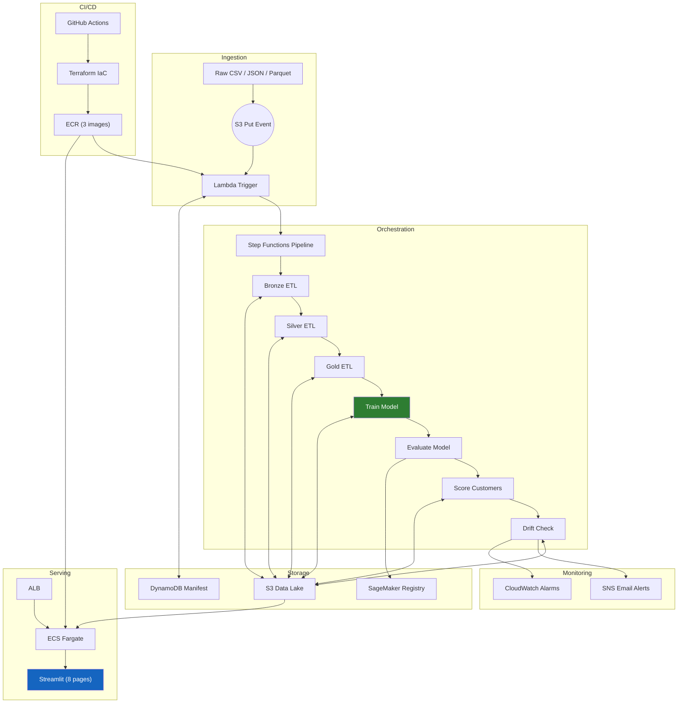
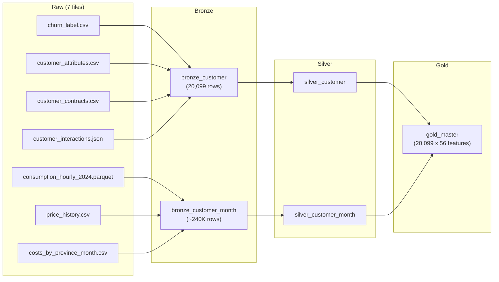
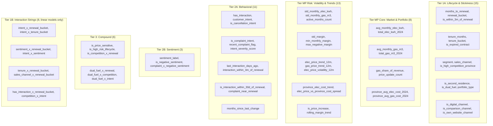
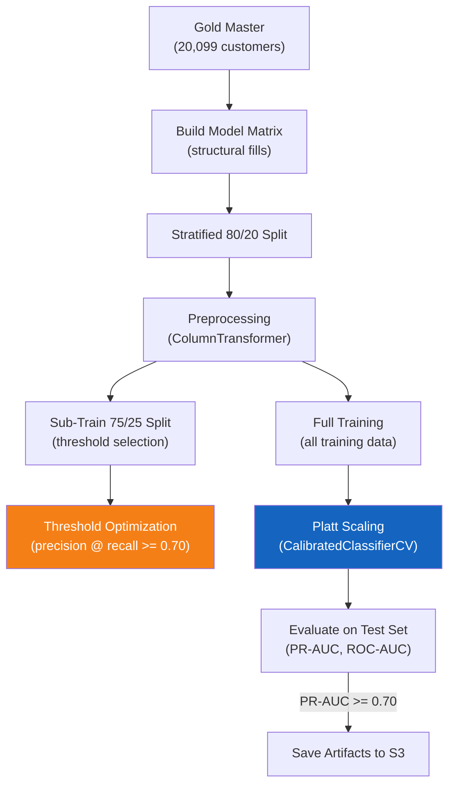
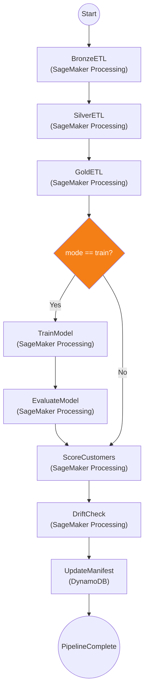
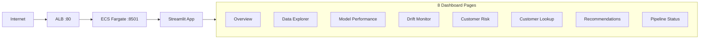

# SpanishGas — Technical Architecture Document

**Version:** 1.0
**Date:** 2026-03-06
**Status:** Production (PR-AUC 0.757, ROC-AUC 0.932)
**Branch:** `feature/aws-mlops-pipeline`

---

## Table of Contents

- [1. Executive Summary](#1-executive-summary)
- [2. System Overview](#2-system-overview)
- [3. High-Level Architecture](#3-high-level-architecture)
- [4. Data Architecture](#4-data-architecture)
  - [4.1 Medallion ETL Pipeline](#41-medallion-etl-pipeline)
  - [4.2 Bronze Layer](#42-bronze-layer)
  - [4.3 Silver Layer](#43-silver-layer)
  - [4.4 Gold Layer](#44-gold-layer)
  - [4.5 S3 Data Lake Layout](#45-s3-data-lake-layout)
- [5. Feature Engineering Architecture](#5-feature-engineering-architecture)
  - [5.1 Feature Tier System](#51-feature-tier-system)
  - [5.2 Experiment Configurations](#52-experiment-configurations)
  - [5.3 NLP Enrichment](#53-nlp-enrichment)
- [6. ML Training Architecture](#6-ml-training-architecture)
  - [6.1 Model Definitions](#61-model-definitions)
  - [6.2 Training Pipeline](#62-training-pipeline)
  - [6.3 Platt Scaling (Calibration)](#63-platt-scaling-calibration)
  - [6.4 Threshold Selection](#64-threshold-selection)
  - [6.5 Promotion Gate](#65-promotion-gate)
- [7. Scoring & Recommendations](#7-scoring--recommendations)
  - [7.1 Batch Scoring](#71-batch-scoring)
  - [7.2 Risk Tier Assignment](#72-risk-tier-assignment)
  - [7.3 Recommendation Engine](#73-recommendation-engine)
- [8. Pipeline Orchestration](#8-pipeline-orchestration)
  - [8.1 Lambda Trigger](#81-lambda-trigger)
  - [8.2 Step Functions State Machine](#82-step-functions-state-machine)
  - [8.3 Idempotency via DynamoDB Manifest](#83-idempotency-via-dynamodb-manifest)
- [9. Monitoring & Drift Detection](#9-monitoring--drift-detection)
  - [9.1 Feature Drift (KS Test)](#91-feature-drift-ks-test)
  - [9.2 Prediction Drift](#92-prediction-drift)
  - [9.3 Data Quality Checks](#93-data-quality-checks)
  - [9.4 Alerting](#94-alerting)
- [10. Serving Architecture](#10-serving-architecture)
  - [10.1 Streamlit Dashboard](#101-streamlit-dashboard)
  - [10.2 ECS Fargate Deployment](#102-ecs-fargate-deployment)
  - [10.3 Data Loading Strategy](#103-data-loading-strategy)
- [11. Infrastructure (Terraform IaC)](#11-infrastructure-terraform-iac)
  - [11.1 Module Overview](#111-module-overview)
  - [11.2 IAM Roles](#112-iam-roles)
  - [11.3 Networking](#113-networking)
  - [11.4 State Backend](#114-state-backend)
- [12. CI/CD Architecture](#12-cicd-architecture)
  - [12.1 CI Workflow](#121-ci-workflow)
  - [12.2 Deploy Workflow](#122-deploy-workflow)
  - [12.3 Retrain Workflow](#123-retrain-workflow)
  - [12.4 GitHub OIDC Authentication](#124-github-oidc-authentication)
- [13. Container Architecture](#13-container-architecture)
- [14. Configuration Management](#14-configuration-management)
- [15. Error Handling & Resilience](#15-error-handling--resilience)
- [16. Testing Strategy](#16-testing-strategy)
- [17. Performance & Scaling](#17-performance--scaling)
- [18. Key Design Decisions](#18-key-design-decisions)
- [19. Known Limitations & Future Work](#19-known-limitations--future-work)

---

## 1. Executive Summary

SpanishGas is a production MLOps platform that predicts customer churn for 20,099 Spanish energy customers, generates retention recommendations, and serves results through a real-time dashboard. The system is built entirely on AWS, managed with Terraform IaC, and deployed via GitHub Actions CI/CD.

**Key Metrics:**
| Metric | Value |
|--------|-------|
| PR-AUC | 0.757 |
| ROC-AUC | 0.932 |
| Features | 56 (7 tiers) |
| Pipeline Runtime | ~28 minutes |
| Tests | 165 (19 files) |
| Terraform Modules | 11 |
| Dashboard Pages | 8 |

---

## 2. System Overview

```
7 Raw Datasets
    -> Lambda Trigger (S3 event)
        -> Step Functions (8-step pipeline)
            -> Medallion ETL (Bronze -> Silver -> Gold)
            -> XGBoost Training + Platt Calibration
            -> Batch Scoring + Risk Tiers
            -> Drift Detection + Alerts
        -> Streamlit Dashboard (ECS Fargate + ALB)
```

**Technology Stack:**

| Layer | Technology |
|-------|-----------|
| Language | Python 3.12 |
| ML Framework | scikit-learn, XGBoost |
| NLP | HuggingFace Transformers (cardiffnlp/twitter-roberta-base-sentiment-latest) |
| Data | pandas, PyArrow, numpy, scipy |
| Orchestration | AWS Step Functions + Lambda |
| Compute | SageMaker Processing Jobs (ml.m5.xlarge) |
| Storage | S3 (data lake), DynamoDB (manifest) |
| Registry | SageMaker Model Package Group |
| Monitoring | CloudWatch Alarms, SNS Email Alerts |
| Serving | Streamlit on ECS Fargate behind ALB |
| IaC | Terraform (11 modules) |
| CI/CD | GitHub Actions (3 workflows) |
| Containers | Docker (3 images, linux/amd64) |
| Linting | Ruff |
| Testing | pytest + moto (AWS mocking) |

---

## 3. High-Level Architecture



---

## 4. Data Architecture

### 4.1 Medallion ETL Pipeline

The system follows a **medallion architecture** where data moves through progressively refined layers:



### 4.2 Bronze Layer

**Source:** `src/data/ingest.py`, `src/data/nlp.py`
**Step:** `src/pipelines/steps/bronze_step.py`

| Output | Grain | Description |
|--------|-------|-------------|
| `bronze_customer` | 1 row/customer | Merge of churn labels + attributes + contracts + NLP-enriched interactions |
| `bronze_customer_month` | 1 row/customer/month | Monthly consumption aggregation from ~17M hourly readings |

**Key Processing:**
- **NLP Enrichment** on interactions JSON before merge:
  - Regex intent classification (8 categories, priority order)
  - HuggingFace sentiment analysis (if `transformers` installed)
  - Adds columns: `customer_intent`, `has_interaction`, `sentiment_label`, `sentiment_neg/neu/pos`
- **Chunked Consumption Processing**: 2M-row batches for memory safety on 17M hourly rows
- **Tariff Tier Assignment**: Spanish PVPC rules for electricity consumption tiers
- **Gas Conversion**: m3 to kWh at 11 kWh/m3 conversion factor

### 4.3 Silver Layer

**Source:** `src/data/silver.py`
**Step:** `src/pipelines/steps/silver_step.py`

**Transforms Applied:**

| Transform | Details |
|-----------|---------|
| Customer Segmentation | Residential / SME / Corporate based on `is_industrial` + `contracted_power_kw` |
| Sub-segment | Primary Residence / Second Residence |
| Sales Channel Cleaning | Spanish-to-English mapping via CHANNEL_MAP |
| Hierarchical Price Imputation | 3-level fallback: Customer ffill/bfill -> Segment x Month median -> National Month median |
| Margin Computation (P&L) | Electricity: tiered revenue - (variable + peaje + fixed costs). Gas: volume x price - costs. Total = elec + gas |

### 4.4 Gold Layer

**Source:** `src/features/build_features.py`
**Step:** `src/pipelines/steps/gold_step.py`

Joins silver tables and engineers 56 features across 7 tiers (detailed in Section 5). Outputs a single `gold_master.parquet` at 1-row-per-customer grain with churn label attached.

### 4.5 S3 Data Lake Layout

```
s3://spanishgas-data-dev/
  raw/                    # 7 source files (CSV, JSON, Parquet)
  bronze/                 # bronze_customer.parquet, bronze_customer_month.parquet
  silver/                 # silver_customer.parquet, silver_customer_month.parquet
  gold/                   # gold_master.parquet
  models/latest/          # model.joblib, metadata.json, evaluation.json
  scored/                 # scored_customers.parquet, recommendations.parquet
  monitoring/             # drift_results.json, reference distributions
```

---

## 5. Feature Engineering Architecture

### 5.1 Feature Tier System

All tiers operate on the 1-row-per-customer gold master, merged onto a `customer_id` backbone.



**Tier Details:**

| Tier | Features | Builder Function | Purpose |
|------|----------|-----------------|---------|
| 1A Lifecycle | 15 | `build_lifecycle_features()` | Contract timing, tenure, channel, segment |
| MP Core | 8 | `build_market_core_features()` | Consumption volumes, revenue mix, province costs |
| MP Risk | 13 | `build_market_risk_features()` | Consumption volatility, margin stability, price trends |
| 2A Behavioral | 11 | `build_behavioral_features()` | Interaction signals, intent classification, timing |
| 2B Sentiment | 3 | `build_sentiment_features()` | NLP-derived sentiment from interactions |
| 3 Compound | 6 | `build_compound_features()` | Cross-tier interaction flags |
| 1B Strings | 8 | `build_compound_features()` | Categorical interaction strings (for linear models) |

### 5.2 Experiment Configurations

Defined in `configs/feature_tiers.yaml`, experiments allow ablation studies:

| Experiment | Tiers | Total Features | Purpose |
|------------|-------|---------------|---------|
| E0_baseline | 1A | 15 | Lifecycle only (baseline) |
| E1_lifecycle_market | 1A + MP Core | 23 | Add consumption/revenue |
| E2_add_risk | + MP Risk | 36 | Add volatility/trend signals |
| E3_add_behavioral | + 2A | 47 | Add interactions/intent |
| E4_add_sentiment | + 2B | 50 | Add sentiment enrichment |
| **E5_full** | **+ 3** | **56** | **Champion (production)** |
| E6_with_strings | + 1B | 64 | Full + interaction strings |
| E7_market_only | MP Core + MP Risk | 21 | Market signals only (ablation) |
| E8_no_sentiment | E5 - 2B | 53 | Fallback if transformers unavailable |

### 5.3 NLP Enrichment

**Source:** `src/data/nlp.py`

| Component | Implementation | Output |
|-----------|---------------|--------|
| Intent Classification | Regex matching, 8 categories, priority order | `customer_intent` (string) |
| Sentiment Analysis | HuggingFace `cardiffnlp/twitter-roberta-base-sentiment-latest` | `sentiment_label`, `sentiment_neg/neu/pos` |
| Guarded Import | `transformers` optional; logs warning if absent | Graceful degradation to intent-only |

**Intent Categories (priority order):** Cancellation, Complaint, Billing, Pricing Offers, Technical, Account Changes, Information Request, Other

---

## 6. ML Training Architecture

### 6.1 Model Definitions

**Source:** `src/models/churn_model.py`

| Model | Configuration | Role |
|-------|--------------|------|
| Dummy (stratified) | `DummyClassifier(strategy="stratified")` | Baseline comparison |
| Dummy (most frequent) | `DummyClassifier(strategy="most_frequent")` | Baseline comparison |
| Logistic Regression | `class_weight="balanced", max_iter=1000` | Linear baseline |
| Random Forest | `n_estimators=300, max_depth=8, class_weight="balanced"` | Ensemble baseline |
| **XGBoost (champion)** | `n_estimators=600, max_depth=3, lr=0.02, subsample=0.8, colsample_bytree=0.7, eval_metric="logloss"` | **Production model** |

**Class Imbalance Handling:** `scale_pos_weight = (1 - churn_rate) / churn_rate` computed dynamically from training data.

### 6.2 Training Pipeline



**Preprocessing (`src/models/preprocessing.py`):**
- Numeric columns: `SimpleImputer(median)` -> `StandardScaler` (linear models only; tree models skip scaling)
- Categorical columns: `SimpleImputer(constant="missing")` -> `OneHotEncoder(handle_unknown="ignore")`
- Binary columns: passthrough

**Structural Fills (`src/data/build_training_set.py`):**
- `last_interaction_days_ago`, `months_since_last_change` -> 9999 (sentinel: "never")
- Interaction string features -> `"no_interaction"`
- Binary flags -> 0

### 6.3 Platt Scaling (Calibration)

Raw XGBoost probabilities are poorly calibrated — a predicted 0.7 doesn't mean 70% true churn rate. Platt scaling fixes this via sigmoid calibration.

**Implementation:**
```
CalibratedClassifierCV(FrozenEstimator(pipeline), method="sigmoid")
```
- `FrozenEstimator` for sklearn >= 1.6 compatibility (prevents re-fitting the base model)
- Falls back to `cv="prefit"` for older sklearn versions
- Calibration data: 25% stratified validation split from training set
- Result: monotonic calibration curve; probabilities trustworthy for risk tier boundaries

### 6.4 Threshold Selection

**Objective:** Maximize precision subject to recall >= 0.70

**Process:**
1. Train a sub-model on 75% of training data
2. Generate validation predictions on the held-out 25%
3. Compute `precision_recall_curve()` -> find thresholds where recall >= 0.70
4. Select threshold with highest precision at that recall level
5. Fallback: if no threshold meets recall constraint, pick best F1

**Current threshold:** ~0.691

### 6.5 Promotion Gate

A model is promoted to production only if **PR-AUC >= 0.70** on the held-out test set. Rejected models are registered with "Rejected" status in SageMaker Model Registry.

**Artifacts saved to S3 (`models/latest/`):**
- `model.joblib` — serialized CalibratedClassifierCV pipeline
- `metadata.json` — threshold, model name, metrics summary
- `evaluation.json` — full metrics, feature list, missing features, confusion matrix

---

## 7. Scoring & Recommendations

### 7.1 Batch Scoring

**Source:** `src/models/scorer.py`, `src/pipelines/steps/score_step.py`

All 20,099 customers are scored in each pipeline run:
1. Load champion model + threshold from S3
2. `pipeline.predict_proba(X)[:, 1]` -> churn probabilities [0, 1]
3. `y_pred = (proba >= threshold).astype(int)` -> binary predictions
4. `expected_monthly_loss = churn_proba * avg_monthly_margin`
5. Sort by `churn_proba` descending

### 7.2 Risk Tier Assignment

| Tier | Probability Range | Current Count |
|------|-------------------|---------------|
| Low | < 40% | 18,158 |
| Medium | 40% - 60% | 673 |
| High | 60% - 80% | 527 |
| Critical | > 80% | 741 |

### 7.3 Recommendation Engine

**Source:** `src/reco/schema.py`, `src/reco/engine.py`

Maps risk tiers to retention actions:

| Risk Tier | Action | Timing Window |
|-----------|--------|---------------|
| Low (<40%) | No offer | 60-90 days |
| Medium (40-60%) | Small offer | 30-60 days |
| High (60-80%) | Medium offer | Immediate |
| Critical (>80%) | Large offer | Immediate |

**Guardrails:**
- **Negative margin block:** If `avg_monthly_margin < 0`, action forced to `no_offer` (can't afford retention discount)
- **Reason codes required:** Every recommendation includes non-empty `reason_codes` (e.g., "critical_churn_risk", "segment_residential")
- **Risk score validated** to [0, 1] range

**Output:** `scored/recommendations.parquet` with: `customer_id`, `risk_score`, `segment`, `action`, `timing_window`, `expected_margin_impact`, `reason_codes`

---

## 8. Pipeline Orchestration

### 8.1 Lambda Trigger

**Source:** `src/pipelines/lambda_handler.py`

Triggered by S3 `PutObject` events on the `raw/` prefix:
1. Extract `file_key` from S3 event
2. Check DynamoDB manifest for idempotency
3. `mark_started()` with conditional write (prevents race conditions)
4. Generate unique `run_id` (UUID)
5. Start Step Functions execution with payload: `{bucket, file_key, run_id, mode}`

### 8.2 Step Functions State Machine

**Definition:** `infra/terraform/modules/step_functions/asl/pipeline.asl.json`



**SageMaker Processing Configuration:**

| Parameter | Value |
|-----------|-------|
| Instance Type | ml.m5.xlarge (4 vCPU, 16 GB RAM) |
| Instance Count | 1 |
| Volume Size | 30 GB |
| Container | ECR `spanishgas-dev-processing:latest` |

Each step receives `S3_BUCKET`, `FILE_KEY`, `RUN_ID`, and `SNS_TOPIC_ARN` as environment variables. Results are appended to the state object via `ResultPath` (e.g., `$.bronze_result`).

### 8.3 Idempotency via DynamoDB Manifest

**Source:** `src/pipelines/manifest.py`

| Attribute | Type | Description |
|-----------|------|-------------|
| `file_key` (PK) | String | S3 key of uploaded file |
| `run_id` | String | UUID per pipeline execution |
| `status` | String | `started` / `completed` |
| `started_at` | String | ISO timestamp |
| `completed_at` | String | ISO timestamp (set on completion) |

**Idempotency mechanism:** `mark_started()` uses `ConditionExpression="attribute_not_exists(file_key)"` — atomic race condition handling prevents duplicate pipeline runs from concurrent Lambda invocations.

---

## 9. Monitoring & Drift Detection

### 9.1 Feature Drift (KS Test)

**Source:** `src/monitoring/drift.py`, `src/pipelines/steps/drift_step.py`

For each numeric feature, the Kolmogorov-Smirnov test compares current scored data against the stored reference distribution:

```
ks_2samp(reference[feature], current[feature]) -> (KS statistic, p-value)
Drift detected if p-value < 0.01 (99% confidence)
```

### 9.2 Prediction Drift

Same KS test applied to `churn_proba` distribution — detects if overall prediction distribution has shifted.

### 9.3 Data Quality Checks

**Source:** `src/monitoring/data_quality.py`

| Check | Thresholds |
|-------|-----------|
| Null rates | Bronze: 20%, Silver: 5%, Gold: 2% |
| Duplicate keys | 0 duplicates on `customer_id` |
| Row/column counts | Logged for tracking |
| Numeric ranges | Min/max per column |
| Schema validation | dtype per column |

### 9.4 Alerting

**Source:** `src/monitoring/alerts.py`

| Channel | Trigger | Content |
|---------|---------|---------|
| SNS Email | Drift detected | Alert with drifted feature names + KS statistics |
| CloudWatch Metric | Every drift check | `DriftDetected` (0/1), `FeaturesDrifted` (count) |
| CloudWatch Alarm | Metric breaches threshold | Auto-triggers on drift metric > 0 |

**Reference Store:** S3 JSON with feature distributions, updated after each clean run. First run saves current data as baseline (no drift comparison).

---

## 10. Serving Architecture

### 10.1 Streamlit Dashboard

**Source:** `src/serving/ui/app.py`



| Page | Description |
|------|-------------|
| Overview | KPI cards: at-risk %, monthly loss, pipeline run count |
| Data Explorer | Browse raw/bronze/silver/gold data tables |
| Model Performance | PR-AUC, ROC-AUC, confusion matrix, precision-recall curve |
| Drift Monitor | KS statistics, feature drift table, bar chart |
| Customer Risk | Risk tier distribution, expected loss, customer table |
| Customer Lookup | Individual customer profile, financials, reason codes |
| Recommendations | Action breakdown by tier, retention offers, timing |
| Pipeline Status | Run history, success/fail counts from DynamoDB |

### 10.2 ECS Fargate Deployment

| Parameter | Value |
|-----------|-------|
| CPU | 512 |
| Memory | 1024 MiB |
| Desired Count | 1 |
| Health Check | `curl /_stcore/health` |
| Port | 8501 |
| ALB | `spanishgas-dev-streamlit-alb` on port 80 |

### 10.3 Data Loading Strategy

**Source:** `src/serving/ui/data_loader.py`

- **Local mode** (development): reads from `data/scored/`, `data/models/`, `data/monitoring/`
- **S3 mode** (production): reads from S3 bucket prefixes
- **DynamoDB**: pipeline run history (scan all items, sort by `started_at` descending)
- **Caching**: `@st.cache_data` with TTL (300s for scored data, 60s for run history)

---

## 11. Infrastructure (Terraform IaC)

### 11.1 Module Overview

```
infra/terraform/modules/
  s3/              - Single data bucket (versioned, encrypted, lifecycle rules)
  dynamodb/        - Manifest table (PAY_PER_REQUEST billing)
  iam/             - 5 IAM roles (Lambda, SFN, SageMaker, ECS exec, ECS task)
  ecr/             - 3 container repositories (lambda, processing, streamlit)
  lambda/          - Pipeline trigger function + S3 event notification
  step_functions/  - State machine + ASL definition
  sagemaker/       - Model Package Group
  monitoring/      - SNS topic + CloudWatch alarms (Lambda errors, SFN failures, drift)
  networking/      - Default VPC lookup, ALB + ECS security groups
  ecs/             - Fargate cluster, task definition, service, ALB, target group, logs
  github_oidc/     - OIDC identity provider + scoped deploy role for GitHub Actions
```

### 11.2 IAM Roles

| Role | Permissions |
|------|------------|
| Lambda Execution | S3 GetObject/ListBucket, DynamoDB GetItem/PutItem, States StartExecution |
| Step Functions | SageMaker CreateProcessingJob, IAM PassRole |
| SageMaker Processing | S3 full access, DynamoDB, CloudWatch, SNS, SageMaker Registry |
| ECS Execution | ECR pull, CloudWatch Logs |
| ECS Task | S3 GetObject (scored/models/monitoring), DynamoDB Scan |

### 11.3 Networking

- Default VPC with public subnets
- ALB security group: inbound 80 from 0.0.0.0/0
- ECS security group: inbound 8501 from ALB security group only

### 11.4 State Backend

| Resource | Name |
|----------|------|
| S3 Bucket | `spanishgas-terraform-state` |
| DynamoDB Table | `spanishgas-terraform-locks` |
| Region | eu-west-1 |

---

## 12. CI/CD Architecture

### 12.1 CI Workflow

**File:** `.github/workflows/ci.yml`
**Trigger:** Push to any branch, PR to main

```
Ruff Check (lint) -> Pytest (165+ tests) -> Coverage Upload
```

### 12.2 Deploy Workflow

**File:** `.github/workflows/deploy.yml`
**Trigger:** Push to main, manual dispatch

```
OIDC Login -> Terraform Init/Plan/Apply -> Docker Build+Push (3 images) -> Update Lambda -> Force ECS Redeploy
```

Requires `production` environment approval.

### 12.3 Retrain Workflow

**File:** `.github/workflows/retrain.yml`
**Trigger:** Weekly (Monday 06:00 UTC), manual dispatch

```
OIDC Login -> Start Step Functions (mode=train) -> Poll for Completion
```

### 12.4 GitHub OIDC Authentication

Passwordless authentication via GitHub OIDC identity provider -> IAM deploy role (`spanishgas-dev-github-deploy-role`). Scoped to repository `rawad-yared/bcgx-spanishgas-g1`. Role ARN stored as GitHub secret `AWS_DEPLOY_ROLE_ARN`.

---

## 13. Container Architecture

| Image | Base | Size | Key Packages | Purpose |
|-------|------|------|-------------|---------|
| `Dockerfile.lambda` | AWS Lambda Python 3.12 | ~500MB | boto3, pyyaml, python-dotenv | Pipeline trigger |
| `Dockerfile.processing` | python:3.12-slim | ~2.5GB | pandas, sklearn, xgboost, torch (CPU), transformers | SageMaker Processing |
| `Dockerfile.streamlit` | python:3.12-slim | ~1GB | pandas, sklearn, streamlit, plotly, boto3 | Dashboard |

**Build requirement:** All images must be built with `--platform linux/amd64 --provenance=false` (Apple Silicon builds arm64 by default; Lambda and SageMaker require x86_64).

The processing image pre-downloads the HuggingFace sentiment model (`cardiffnlp/twitter-roberta-base-sentiment-latest`) at build time to avoid runtime downloads in SageMaker.

---

## 14. Configuration Management

### Settings (`configs/settings.py`)

Nested dataclass structure with `.env` file loading:

| Settings Group | Key Parameters |
|---------------|----------------|
| AWSSettings | `region`, `s3_bucket`, S3 prefix paths, `dynamodb_manifest_table`, `sagemaker_role_arn`, `step_functions_arn`, `sns_topic_arn` |
| ModelSettings | `promotion_pr_auc_threshold=0.70`, `target_recall=0.70`, `risk_tier_thresholds=(0.40, 0.60, 0.80)` |
| Global | `data_dir`, `log_level` |

### Feature Configuration (`configs/feature_tiers.yaml`)

YAML definition of 8 feature tiers (column name lists) and 9 experiment configurations (tier combinations + descriptions).

### Column Registry (`configs/column_registry.yaml`)

Raw dataset schemas with dtypes, structural fill values, and expected column names per source file.

---

## 15. Error Handling & Resilience

| Layer | Strategy |
|-------|----------|
| Lambda | DynamoDB conditional writes prevent duplicate executions; returns "skipped" or "in_progress" for already-processed files |
| Step Functions | Sync mode — implicit failure if any processing job fails; manifest always updated with final status |
| Data Quality | Logged but non-blocking (pipeline continues with warnings) |
| Missing Features | Logged + recorded in evaluation.json; model trained on available features only |
| NLP Enrichment | Graceful degradation if `transformers` not installed; intent-only mode |
| Price Imputation | 3-level hierarchical fallback guarantees no missing price values |
| Reference Store | First run catches `NoSuchKey`, saves current data as baseline, returns "first_run" |
| JSON Serialization | Custom `_json_default()` handler for numpy types (bool_, integer, floating, ndarray) |

---

## 16. Testing Strategy

**165 tests across 19 files:**

| Test File | Count | Focus | Mocking |
|-----------|-------|-------|---------|
| `test_settings.py` | 5 | Env var loading, defaults | - |
| `test_ingest.py` | 6 | CSV/JSON loading, tariff assignment | - |
| `test_silver.py` | 8 | Segmentation, price imputation, margins | - |
| `test_build_features.py` | 16 | All 7 tiers, compound features | - |
| `test_build_training_set.py` | 5 | Matrix construction, train/test split | - |
| `test_models.py` | 9 | Preprocessing, hyperparams, calibration, scoring | - |
| `test_reco.py` | 7 | Recommendation generation, guardrails | - |
| `test_nlp.py` | 20 | Intent classification (8 categories), sentiment | - |
| `test_lambda_handler.py` | 3 | Lambda invocation | moto (DynamoDB, SFN) |
| `test_manifest.py` | 5 | DynamoDB CRUD | moto (DynamoDB) |
| `test_s3_io.py` | 5 | Parquet/JSON/CSV round-trips | moto (S3) |
| `test_artifacts.py` | 2 | Model save/load | moto (S3) |
| `test_drift.py` | 10 | KS test, drift detection | - |
| `test_data_quality.py` | 7 | Null rates, duplicates, schema | - |
| `test_alerts.py` | 5 | SNS/CloudWatch publication | moto (SNS, CW) |
| `test_streamlit_data_loader.py` | 10 | File/S3 loading, caching | - |
| `test_streamlit_pages.py` | 12 | Page rendering | Mock data |
| `test_pipeline_e2e.py` | 22 | Full ETL -> train -> score -> drift | - |
| `test_imports.py` | 1 | Package import smoke test | - |

**AWS Mocking:** `moto` library for S3, DynamoDB, SNS, CloudWatch, Step Functions.

---

## 17. Performance & Scaling

### Current Performance

| Metric | Value |
|--------|-------|
| Full pipeline runtime | ~28 minutes (8 steps) |
| Bronze (17M rows -> 240K) | ~4 min |
| Gold (20K x 56 features) | ~2 min |
| Training (16K samples) | ~3 min |
| Scoring (20K customers) | ~2 min |

### Bottlenecks

1. **Consumption batch processing** — I/O bound; 2M-row chunks are optimal
2. **Sentiment analysis** — NLP model inference ~1 min for 20K texts
3. **Feature engineering** — 200+ calculations; vectorized with numpy

### Scaling Strategies

- **Vertical:** Switch to ml.m5.2xlarge or ml.c5.4xlarge for compute-heavy steps
- **Horizontal:** Multi-node SageMaker Processing (not yet implemented)
- **Pipeline parallelism:** Bronze/Silver/Gold could theoretically run in parallel

---

## 18. Key Design Decisions

| Decision | Rationale |
|----------|-----------|
| **Platt Scaling** | Raw XGBoost probabilities uncalibrated; risk tier boundaries (0.40/0.60/0.80) require trustworthy probabilities |
| **Chunked Consumption** | 17M hourly rows exceeds memory limits; 2M-row streaming maintains low peak memory |
| **Hierarchical Price Imputation** | 3-level fallback (customer -> segment -> national) preserves customer patterns while filling gaps |
| **Structural Fills** | Missing = "never interacted" (sentinel 9999), not "unknown" — distinct signal for tree models |
| **Multi-Tier Features** | Enables ablation studies (E0-E8) + production fallback (E8_no_sentiment if transformers unavailable) |
| **Choice-Based Train/Score** | SFN Choice state reuses bronze/silver/gold ETL for both training and inference — no duplicate logic |
| **DynamoDB Conditional Writes** | Atomic idempotency despite Lambda retries or concurrent S3 uploads |
| **KS Test for Drift** | Distribution-agnostic; works for arbitrary feature shapes; p < 0.01 threshold |
| **Negative Margin Block** | Hard guardrail — retention discount would lose money; better to let churn |
| **FrozenEstimator Compat** | sklearn >= 1.6 removed `cv="prefit"` for CalibratedClassifierCV; FrozenEstimator with try/except handles both |

---

## 19. Known Limitations & Future Work

### Current Limitations

1. **No concept drift detection** — KS test detects distribution shifts, not P(churn|X) changes
2. **Fixed threshold** — 0.691 set at training time; no adaptive retraining
3. **Single-node processing** — SageMaker jobs run on 1 instance
4. **Batch scoring only** — No real-time prediction API (REST/gRPC)
5. **No persistent feature store** — Features computed ad-hoc each run
6. **Locked sentiment model** — HuggingFace model version fixed at Docker build time

### Recommended Next Steps

1. **Real-time scoring API** — Lambda or SageMaker endpoint for on-demand single-customer predictions
2. **Adaptive thresholding** — Recompute threshold quarterly based on recent churn outcomes
3. **Feature store** — Tecton or Feast for versioned feature lineage + offline/online consistency
4. **Concept drift detection** — Track P(churn|tier) over time; alert when tiers become unpredictive
5. **Hyperparameter tuning** — Optuna/Bayesian optimization instead of manual grid search
6. **Explainability** — SHAP or LIME for per-customer feature importance
7. **A/B testing framework** — Measure actual retention impact of recommendations

---

## Appendix: Module Map

```
configs/                   - Settings, feature_tiers.yaml, column_registry.yaml
src/data/                  - ingest.py, silver.py, build_training_set.py, nlp.py
src/features/              - build_features.py (7 tiers, gold master)
src/models/                - churn_model.py, preprocessing.py, scorer.py, artifacts.py, registry.py
src/reco/                  - schema.py, engine.py
src/pipelines/             - lambda_handler.py, manifest.py, s3_io.py, run.py
src/pipelines/steps/       - bronze, silver, gold, train, evaluate, score, drift steps
src/monitoring/            - drift.py, data_quality.py, alerts.py, reference_store.py
src/serving/ui/            - app.py, data_loader.py, pages/ (8 pages)
infra/terraform/           - main.tf, backend.tf, variables.tf, outputs.tf + 11 modules
.github/workflows/         - ci.yml, deploy.yml, retrain.yml
Dockerfile.lambda          - Lambda container image
Dockerfile.processing      - SageMaker Processing container image
Dockerfile.streamlit       - Streamlit dashboard container image
```
